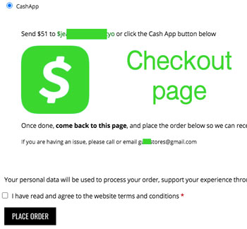
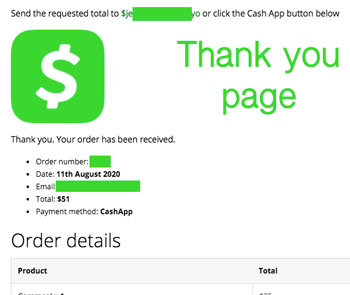
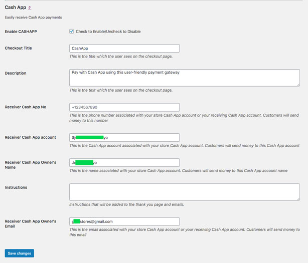

  

  <h3 align="center">MOMO Cash App - Checkout on Woocommerce with Cashapp</h3>

  

    The #1 finance app in the App Store now available on WordPress. Receive Cash App payments on your website with WooCommerce + Cash App
     
    <a href="https://theafricanboss.com/cashapp"><strong>Learn More »</strong></a>
     
     
    <a href="https://theafricanboss.com/cashapp">View Demo</a>
    ·
    <a href="https://github.com/theafricanboss/woocommerce-cashapp/issues">Report Bug</a>
    ·
    <a href="https://github.com/theafricanboss/woocommerce-cashapp/issues">Request Feature</a>
  

## PRO or customized version

Please reach out to theafricanboss@gmail.com for a custom version of this plugin.

Visit [The African Boss](https://theafricanboss.com/cashapp) for more details

## Demo

An example of the plugin in use is the following store:

[Gura Stores](https://gurastores.com/)

This plugin displays a Cash App link or a QR code

See the screenshots or the store example of [Gura Stores](https://gurastores.com/) for visual details.

## Screenshots

- This is what the customer visiting your website will see at the checkout page

- This is what the customer visiting your website will see on the thank you page after placing the order

- This is what you will submit when setting up the plugin and this information will be displayed to your customers

## Installation

### From Dashboard ( WordPress admin )

- Go to Plugins -> Add New
- Search for ‘MOMO Cash App’
- Click on Install Now
- Activate the plugin through the “Plugins” menu in WordPress.

### Using cPanel or FTP

- Download ‘MOMO Cash App’ from [The African Boss](https://theafricanboss.com/cashapp)
- Unzip wc-cashapp.zip’ file and
- Upload wc-cashapp folder to the “/wp-content/plugins/” directory.
- Activate the plugin through the “Plugins” menu in WordPress.

### After Plugin Activation

Find and click Cash App in your admin dashboard left sidebar to access Cash App settings

**or**

Go to Woocommerce-> Settings-> Payments screen to configure the plugin

Also _you can visit_ the [plugin page](https://theafricanboss.com/cashapp) for further setup instructions.

## Frequently Asked Questions

### Does Cash App integrate Payment APIs?

Cash App plugin is a quick and easy way to display to your customers your CashTag and to link them to it.
Unfortunately, this plugin doesn't integrate a full CashApp end-to-end payment. It only displays your cashtag to the customer and redirects them to it so that the off site Cash App transaction can take place.

Please check screenshots for more details on what is reported.
